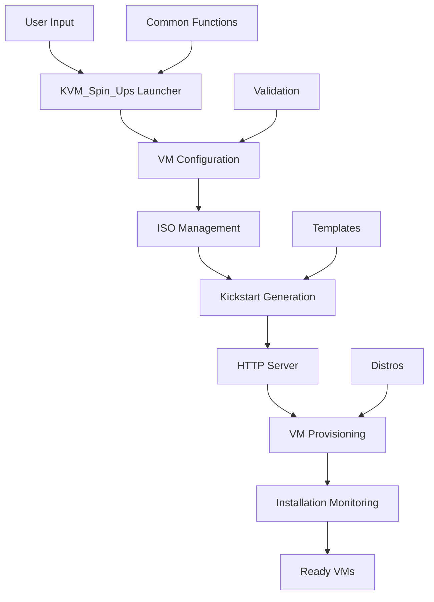

# KVM_Spin_Ups


> **Automated Infrastructure as Code (IaC) for KVM Virtual Machines**
> *Zero-to-VM in minutes with automated provisioning and configuration*

[](LICENSE)
[](https://www.linux.org/)
[](https://www.linux-kvm.org/)
[](https://www.gnu.org/software/bash/)
[](https://devops.com)

---

## 🚀 What is KVM_Spin_Ups?

KVM_Spin_Ups is a **DevOps-ready automation tool** that transforms your Linux workstation into a powerful virtualization platform. It enables rapid, repeatable VM provisioning using **Infrastructure as Code principles** with minimal setup overhead.

### Key Benefits for DevOps Engineers:
- ✅ **Lightning-fast VM provisioning** - From zero to running VM in under 10 minutes
- ✅ **Infrastructure as Code** - Declarative VM specifications with reproducible results
- ✅ **No cloud costs** - Run VMs locally with full control over resources
- ✅ **Automated OS installation** - Kickstart-based provisioning with no manual intervention
- ✅ **Multi-VM orchestration** - Create complete test environments with a single command
- ✅ **Production-like environments** - Use enterprise-grade distributions (Rocky Linux, AlmaLinux)

---

## 🎯 Perfect For These DevOps Scenarios

| Use Case | Description | Benefit |
|----------|-------------|---------|
| **CI/CD Pipeline Testing** | Spin up disposable test environments | Isolated, consistent testing environments |
| **Infrastructure Automation** | Test Ansible, Terraform, Puppet scripts | Local validation before production deployment |
| **Multi-Node Cluster Simulation** | Create Kubernetes, database, or HA clusters | Test clustering and orchestration locally |
| **Learning & Training** | Hands-on experience with enterprise Linux | No cloud costs, full control |
| **Disaster Recovery Testing** | Practice backup/restore procedures | Safe, isolated environment |

---

## 🛠️ Architecture & Technology Stack

### Core Components


### Technology Stack
- **Virtualization:** KVM/QEMU with Libvirt API
- **Automation:** Kickstart for unattended OS installation
- **Scripting:** Pure Bash with modular architecture
- **Networking:** NAT with DHCP and HTTP server for kickstart delivery
- **Security:** Encrypted password hashes, firewall configuration

---

## 🚀 Quick Start for DevOps Engineers

### Prerequisites
```bash
# Ubuntu/Debian
sudo apt install qemu-kvm libvirt-daemon-system libvirt-clients virtinst bridge-utils curl python3

# RHEL/CentOS/Rocky/AlmaLinux
sudo dnf install @virtualization virt-install libvirt curl python3

# Add user to required groups
sudo usermod -a -G libvirt,kvm $USER
newgrp libvirt  # Or log out and back in
```

### Installation & Execution
```bash
# Clone the repository
git clone https://github.com/your-username/KVM_Spin_Ups.git
cd KVM_Spin_Ups

# Make executable and run
chmod +x src/KVM_Spin_Ups.sh
bash src/KVM_Spin_Ups.sh
```

### Example VM Configuration
```yaml
VM Count: 3
VM #1:
  Distribution: Rocky Linux 9.7
  Hostname: web-server-01
  RAM: 2048 MB
  vCPUs: 2
  Disk: 30 GB
  Timezone: UTC
  User: ops
  Access: SSH + virsh console

VM #2:
  Distribution: AlmaLinux 10.1
  Hostname: db-server-01
  RAM: 4096 MB
  vCPUs: 2
  Disk: 50 GB

VM #3:
  Distribution: Rocky Linux 9.7
  Hostname: app-server-01
  RAM: 3072 MB
  vCPUs: 2
  Disk: 40 GB
```

---

## 🐧 Supported Distributions

| Distribution | Version | Use Case | Notes |
|--------------|---------|----------|-------|
| **Rocky Linux** | 9.7 | Production-like EL | RHEL-compatible, enterprise-grade |
| **AlmaLinux** | 10.1 | Latest EL features | Community-driven, cloud-ready |

---

## ⚙️ VM Configuration Options

### Customizable Parameters
- **Hostname** - Unique identifier for the VM
- **RAM** - 1024MB to 16384MB (1GB to 16GB)
- **vCPUs** - 1 to 16 virtual CPUs
- **Disk Size** - 10GB to 500GB storage
- **Timezone** - Any valid timezone (default: Africa/Cairo)
- **User Management** - Custom user passwords with sudo access
- **Network** - NAT with DHCP (192.168.122.0/24)

### Default Configuration
- **User:** `ops` with passwordless sudo
- **Access:** SSH and virsh console
- **Security:** Root login disabled via SSH, firewall enabled
- **Timezone:** Africa/Cairo (configurable)

---

## 🔧 DevOps Integration

### VM Management Commands
```bash
# List all VMs
virsh list --all

# Start/Stop VMs
virsh start vm-name
virsh shutdown vm-name
virsh destroy vm-name  # Force stop

# Access VM console
virsh console vm-name

# Get VM IP address
virsh net-dhcp-leases default

# SSH access
ssh ops@vm-ip-address
```

### Automation Examples
```bash
# Wait for VM to be accessible
while ! ssh -o ConnectTimeout=5 ops@vm-ip 'true' 2>/dev/null; do
  sleep 5
  echo "Waiting for VM to be ready..."
done

# Deploy configuration after VM creation
ssh ops@vm-ip 'sudo yum install -y ansible'
scp playbook.yml ops@vm-ip:~/
ssh ops@vm-ip 'ansible-playbook playbook.yml'
```

---

## 📁 Project Structure

```
KVM_Spin_Ups/
├── README.md                 # This file
├── LICENSE                   # MIT License
├── INSTALLATION_Guide.md     # Detailed setup instructions
├── Debugging.md             # Troubleshooting guide
├── src/                     # Source code
│   ├── KVM_Spin_Ups.sh      # Main launcher script
│   ├── common-functions.sh  # Shared utilities
│   ├── validation-functions.sh # Input validation
│   ├── distros-installers/  # Distribution-specific installers
│   │   ├── rocky-linux-installers.sh
│   │   └── alma-linux-installers.sh
│   └── templates/           # Kickstart templates
│       ├── rocky-ks.cfg.template
│       └── alma-ks.cfg.template
├── docs/                    # Documentation
│   └── architecture.md
├── examples/                # Usage examples
│   └── basic-usage.md
├── iso/                     # Downloaded ISOs
├── mounts/                  # Mount points for ISO extraction
├── vms/                     # VM disk images
└── tests/                   # Test scripts
```

---

## 🛡️ Security & Best Practices

### Security Features
- **Encrypted Passwords:** SHA-512 hashed passwords using Python crypt
- **Restricted Root Access:** Root login disabled via SSH
- **Firewall Configuration:** Automatic firewall setup with SSH allowed
- **Isolated Network:** NAT network prevents direct external access

### DevOps Best Practices Implemented
- **Idempotency:** Safe to run multiple times without side effects
- **Configuration Management:** Template-based kickstart files
- **Infrastructure as Code:** Declarative VM specifications
- **Automated Provisioning:** No manual intervention required
- **Resource Management:** Configurable resource allocation

---

## 🚨 Troubleshooting

### Common Issues & Solutions

#### Permission Issues
```bash
# Check group membership
groups | grep libvirt

# Add user to groups if missing
sudo usermod -a -G libvirt,kvm $USER
newgrp libvirt
```

#### Virtualization Not Available
```bash
# Check CPU support
egrep -c '(vmx|svm)' /proc/cpuinfo  # Should return > 0

# Load KVM modules
sudo modprobe kvm
sudo modprobe kvm_intel  # or kvm_amd for AMD
```

#### VM Access Issues
```bash
# Get VM IP
virsh net-dhcp-leases default

# Access via console
virsh console vm-name

# Check VM state
virsh domstate vm-name
```

### Getting Help
- Check `INSTALLATION_Guide.md` for detailed troubleshooting
- Review `Debugging.md` for common error patterns
- File issues on GitHub with system details and error messages

---

## 🤝 Contributing

### Development Guidelines
1. **Fork** the repository
2. **Create** a feature branch (`git checkout -b feature/amazing-feature`)
3. **Implement** your changes with proper error handling
4. **Test** thoroughly across supported distributions
5. **Document** new features or changes
6. **Submit** a pull request with clear description

### Areas Needing Contributions
- [ ] Additional distribution support (Ubuntu, Debian, Fedora)
- [ ] Advanced networking options (bridged, custom networks)
- [ ] VM snapshot and backup functionality
- [ ] Integration with configuration management tools
- [ ] Enhanced monitoring and metrics

---

## 📈 Roadmap

### Q1 2025
- [ ] Cloud-init support for advanced configuration
- [ ] Integration with Ansible for post-install configuration
- [ ] VM cloning and template creation
- [ ] Enhanced security options (custom SSH keys)

### Q2 2025
- [ ] Support for additional distributions (Ubuntu, Debian, Fedora)
- [ ] Web-based management interface
- [ ] VM backup and restore functionality
- [ ] Integration with monitoring tools

### Q3 2025
- [ ] Multi-host orchestration
- [ ] Container integration (Podman/LXC)
- [ ] High availability cluster simulation
- [ ] Performance monitoring and reporting

---

## 📄 License

This project is licensed under the MIT License - see the [LICENSE](LICENSE) file for details.

---

## 🙏 Acknowledgments

- The KVM and libvirt projects for providing robust virtualization technology
- The Rocky Linux and AlmaLinux communities for enterprise-grade distributions
- The DevOps community for inspiration and best practices
- All contributors who help improve this tool

---

## 🎉 Ready to Transform Your DevOps Workflow?

KVM_Spin_Ups bridges the gap between development and operations by providing production-like environments on your local hardware. Whether you're testing infrastructure automation, simulating multi-node clusters, or learning enterprise Linux distributions, KVM_Spin_Ups provides the foundation for effective DevOps practices.

**Start your first VM in minutes, not hours.**

---

*Made with ❤️ by the open-source community for DevOps engineers worldwide*