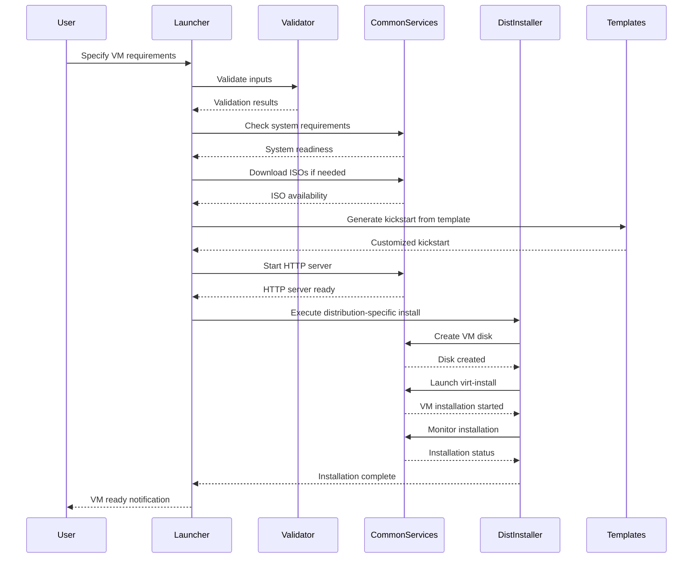

# KVM_Spin_Ups Architecture

## Overview

KVM_Spin_Ups is a **DevOps-ready Infrastructure as Code (IaC) platform** that automates the provisioning of enterprise-grade KVM virtual machines. The architecture follows modern DevOps principles with modular design, automated workflows, and infrastructure automation capabilities.

### Key Architectural Principles
- **Modular Design:** Separation of concerns with dedicated components
- **Infrastructure as Code:** Declarative VM specifications with reproducible results
- **Automated Provisioning:** Zero-touch installation from ISO to running VM
- **Enterprise Ready:** Production-like environments with security and compliance
- **Scalable:** Support for multi-VM orchestration and batch operations

---

## Component Architecture

### 1. **Orchestration Layer (`src/KVM_Spin_Ups.sh`)**
**Purpose:** Main application orchestrator and user interface
- **Role:** Entry point, workflow management, batch processing
- **Responsibilities:**
  - Interactive user prompting and validation
  - VM configuration collection and storage
  - Batch job orchestration
  - Progress monitoring and reporting
  - Error handling and recovery
- **DevOps Value:** Single-command infrastructure provisioning

### 2. **Common Services Layer (`src/common-functions.sh`)**
**Purpose:** Shared utilities and cross-cutting concerns
- **Role:** Foundation services for all components
- **Responsibilities:**
  - System health checks and dependency validation
  - Logging and error reporting
  - Network configuration and management
  - ISO download and cache management
  - HTTP server orchestration for kickstart delivery
  - VM lifecycle management utilities
  - Security functions (password hashing, validation)
- **DevOps Value:** Consistent, reliable shared services across all operations

### 3. **Validation Layer (`src/validation-functions.sh`)**
**Purpose:** Input validation and system readiness checks
- **Role:** Quality assurance and system validation
- **Responsibilities:**
  - User input validation and sanitization
  - System requirement verification
  - Resource availability checks
  - Security validation
- **DevOps Value:** Prevents invalid configurations and system conflicts

### 4. **Distribution-Specific Installers (`src/distros-installers/`)**
**Purpose:** OS-specific installation and configuration
- **Role:** Platform-specific VM provisioning
- **Components:**
  - `rocky-linux-installers.sh` - Rocky Linux 9.7 provisioning
  - `alma-linux-installers.sh` - AlmaLinux 10.1 provisioning
- **Responsibilities:**
  - Distribution-specific kickstart generation
  - OS installation orchestration
  - Post-installation configuration
  - Service activation and validation
- **DevOps Value:** Consistent provisioning across different enterprise distributions

### 5. **Configuration Templates (`src/templates/`)**
**Purpose:** Standardized VM configuration blueprints
- **Role:** Declarative configuration management
- **Components:**
  - `rocky-ks.cfg.template` - Rocky Linux kickstart template
  - `alma-ks.cfg.template` - AlmaLinux kickstart template
- **Responsibilities:**
  - Standardized OS installation parameters
  - User account configuration
  - Network and security settings
  - Package selection and customization
- **DevOps Value:** Reusable, version-controlled configuration patterns

---

## Data Flow Architecture

### VM Provisioning Workflow

### Key Data Flows
1. **Configuration Flow:** User input → Validation → Template processing → VM configuration
2. **Resource Flow:** ISO download → Disk creation → VM provisioning → Resource allocation
3. **Monitoring Flow:** Installation progress → Status updates → Completion reporting
4. **Security Flow:** Password input → Hashing → Secure storage → Configuration injection

---

## DevOps Integration Points

### CI/CD Pipeline Integration
- **Automated Testing:** Provision test environments on-demand
- **Build Verification:** Validate applications in production-like environments
- **Release Preparation:** Pre-deployment testing in identical environments

### Infrastructure as Code
- **Declarative Specifications:** YAML-style VM definitions
- **Version Control:** All configurations under Git management
- **Reproducible Environments:** Identical VMs across different hosts

### Monitoring & Observability
- **Comprehensive Logging:** Structured logs for troubleshooting
- **Progress Tracking:** Real-time installation monitoring
- **Health Checks:** Automated system validation

---

## Security Architecture

### Defense Layers
1. **Input Validation:** Sanitized user inputs prevent injection attacks
2. **Secure Communication:** HTTP server with limited scope
3. **Encrypted Storage:** Passwords stored as SHA-512 hashes
4. **Network Isolation:** NAT network prevents unauthorized access
5. **Least Privilege:** Minimal required permissions for operations

### Compliance Considerations
- **Audit Trail:** All operations logged with timestamps
- **Configuration Management:** Template-based configurations
- **Access Controls:** Role-based access through system permissions

---

## Scalability & Performance

### Resource Management
- **Efficient Caching:** ISO files cached for reuse
- **Concurrent Operations:** Sequential VM creation with monitoring
- **Memory Optimization:** Efficient bash scripting for low overhead

### Multi-VM Orchestration
- **Batch Processing:** Up to 10 VMs in single operation
- **Dependency Management:** Sequential installation with validation
- **Resource Allocation:** Configurable limits per VM

---

## Technology Stack

### Core Technologies
- **Virtualization:** KVM/QEMU with Libvirt API
- **Automation:** Kickstart for unattended OS installation
- **Scripting:** Bash with modular architecture
- **Networking:** NAT with DHCP and HTTP delivery
- **Security:** SHA-512 password hashing with Python crypt

### DevOps Tools Integration
- **Configuration Management:** Compatible with Ansible, Puppet, Chef
- **Monitoring:** Standard Linux logging and metrics
- **Container Integration:** Future support for Podman/LXC
- **Cloud Native:** Designed for hybrid cloud scenarios

---

## Deployment Architecture

### Local Development Environment
- **Single Host:** All components on local machine
- **Resource Isolation:** Dedicated VM network and storage
- **Development Cycle:** Rapid iteration with automated provisioning

### Enterprise Deployment Patterns
- **Standalone:** Individual developer environments
- **Team Shared:** Centralized VM provisioning for teams
- **Hybrid:** Integration with cloud and container environments

---

## Future Architecture Evolution

### Planned Enhancements
- **State Management:** Terraform-like state tracking
- **Cloud Integration:** Hybrid cloud provisioning
- **Container Support:** Podman/LXC integration
- **Web Interface:** GUI management console
- **API Layer:** RESTful API for programmatic access

### Scalability Improvements
- **Multi-Host:** Distributed VM orchestration
- **High Availability:** VM clustering and failover
- **Performance:** Parallel VM creation capabilities

---

*This architecture is designed to evolve with DevOps best practices and emerging technologies.*